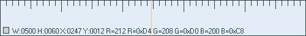
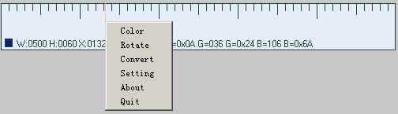
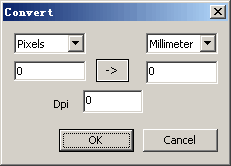

zjruler
=======
zjruler 像素尺
-------

### Introduction ###
a pixel ruler in windows

* Pick color 屏幕取色

* Rotate 旋转

* convert 单位转换

	pixel <--DPI--> Millimeter/Inch

* Transparent 设置透明度

### Snapshot ###

### develop ###

C++,MFC

[source code源码](https://github.com/codepongo/zjruler)
